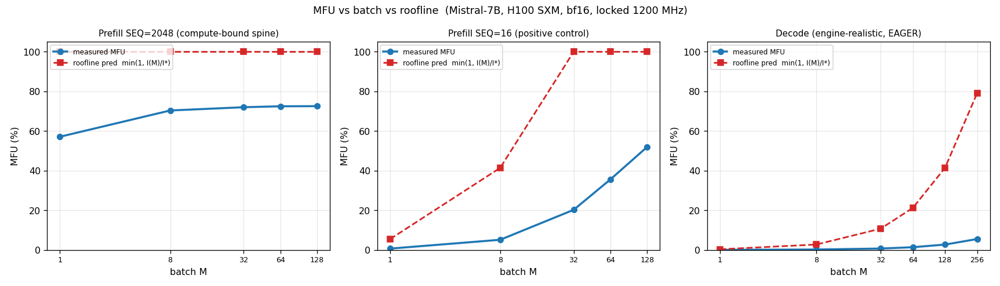
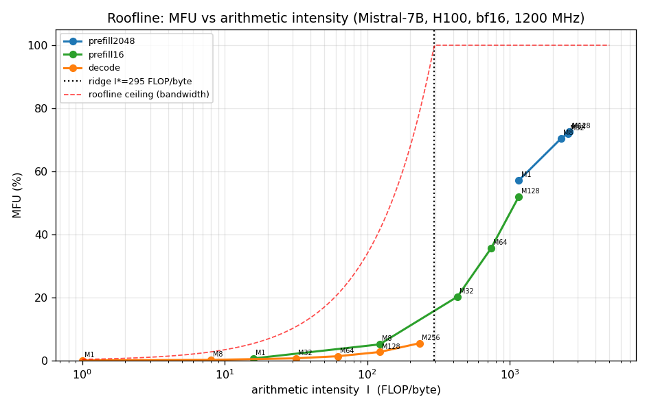

# Does driver-level batching raise MFU? — roofline test, Mistral-7B on H100 SXM

**2026-06-04. READ-ONLY measurement. No `.so` change** — shipped/anchored runtime `cipher_rt_phase4/libcipher_rt.so`
(md5 `2edba0d2`, the Jun-01 anchor) used only to drive the FP8 actuator via `CUDA_INJECTION64_PATH`; bf16 baseline runs
do not touch it. Harness `/home/ubuntu/mfu_batch_sweep.py`, analysis `/home/ubuntu/mfu_analyze.py`, plots
`mfu_vs_batch.png` / `mfu_roofline.png`. SM clock **locked at 1200 MHz** for every number (the documented DVFS trap),
verified `clk_min==clk_max==1200` at every point including M=128.

---

## TL;DR — the two questions, answered with measured numbers

**Q1 — Does MFU climb with batch toward the roofline ceiling (is batching the driver-level MFU lever)?**
**No, not for compute-bound prefill — and the premise contains the answer.** At SEQ=2048 the arithmetic intensity is
**already 4–9× past the roofline ridge at M=1** (I=1158 vs I\*=295 FLOP/byte), so the roofline prediction `min(1, I(M)/I*)`
is a **flat line pinned at 1.0** for the entire sweep — there is no ramp to climb. Measured MFU rises **57.1% → 70.4%**
from M=1→8 (fixed non-GEMM/launch overhead amortizing) and then **plateaus at ~72.5%** (M=32/64/128), a **constant
~28-point gap below the ceiling** that batching does not close. That gap is the non-GEMM fraction (attention, norms,
launch), not arithmetic intensity. *(So batching is not useless in prefill — it buys a real ~15-point overhead-amortization
gain — but the* roofline *lever this test probes is **not engaged**, because you are already past the ridge.)* **Batching
IS that roofline lever — but only in the memory-bound regimes**: the SEQ=16 positive control climbs **0.6% → 52%** and
decode climbs **0% → 5.5%** as batching raises arithmetic intensity across the ridge.

**Q2 — Does FP8 kernel substitution move MFU, or only power/MBU?**
**Only throughput and power — not MFU.** At fixed batch in compute-bound prefill, FP8 substitution gives **1.05× → 1.19×
throughput** (growing with batch) and cuts power **12–23%** (≈**1.36× tok/W**), but against **FP8's own 2× peak its MFU is
29.6–43.2% — *lower* than bf16's 56–72.5%** against the bf16 peak. Substitution moves the work onto a faster roofline it
cannot keep fed (the forward is non-GEMM-bound and a per-call requant tax eats the headroom). The tempting "FP8 ≈ 86% MFU"
is only against the **bf16** peak — i.e. the 1.19× throughput re-expressed in the wrong denominator, **not** a utilization
gain. *(Performance-only: this run did not check output quality, and this exact actuator is on record at +0.72% PPL,
which fails the 0.37% bar — so the throughput/energy numbers are not a deployable win as-is. See caveats.)*

**Bottom line for the driver layer:** batching moves MFU only by moving you *up the roofline ramp* (decode / short
context); once you are past the ridge (prefill), neither batching nor FP8 substitution raises MFU — batching then only
amortizes overhead and substitution only buys throughput/energy. **85% single-GPU MFU is unreachable at this boundary;
it is a kernel-fusion / multi-GPU number** (consistent with the prior G-O3 finding).

---

## Setup & methodology

| | |
|---|---|
| GPU | NVIDIA H100 80GB HBM3 **SXM** (CC 9.0), driver 580.105.08, CUDA 13.0 |
| Model | **Mistral-7B-v0.1**, real weights, bf16, `transformers` 5.8.1 / torch 2.11.0+cu130 |
| Workload | **prefill forward** (no generation); lm_head last-token only (`logits_to_keep=1`, serving-realistic, avoids the 16.8 GB-at-M=128 logits OOM) |
| Clock | **locked 1200 MHz** in-process (sustainable; removes the DVFS confound), verified flat every point |
| FLOP/tok | `L·(Σ 2·k·n over q,k,v,o,gate,up,down + 4·nh·hd·SEQ) + batch·2HV`  =  **13.96 GFLOP/tok** linear ( = 2× the 6.98 B non-embedding params; GQA handled: k/v out=1024) + attention + lm_head |
| Peak | H100 SXM **bf16 dense 989.4 TFLOP/s** / **FP8 dense 1978.9** @1980 MHz (datasheet), scaled to 1200 ⇒ **599.6 / 1199.3**; HBM3 **3.35 TB/s** |
| Ridge | **I\* = 989.4e12 / 3.35e12 = 295.3 FLOP/byte** (bf16); FP8 ridge 590.7 |
| Arithmetic intensity | aggregate over the linear GEMMs, weights-read-once + activation traffic, 2 B/elem: `I(M)=Σ2·m·k·n / Σ2·(k·n + m·k + m·n)`, m = M·SEQ (prefill) or M (decode) |
| MFU | achieved (model FLOP·tok/s) ÷ peak-at-locked-clock; timed over 30 iters after 8 warmup, `torch.cuda.synchronize` |

Each config is a fresh process. FP8 ON = `CUDA_INJECTION64_PATH=$SO CIPHER_FP8=1` (LD_PRELOAD crashes model load in this
stack — the documented fragility; injection is the robust path). FP8 OFF control = `CUDA_INJECTION64_PATH=$SO CIPHER_FP8=0`
(matches pure bf16 to <1 pt → injection overhead negligible). Substitution confirmed live: `fp8_handled>0`, `wq=224`.

---

## Q1 — batch sweep, prefill SEQ=2048 (the compute-bound spine)

bf16, locked 1200 MHz (peak 599.6 TFLOP/s). M=128 fit only with `expandable_segments` at the 80 GB edge (80,073 MB).

| M | tok/s | TFLOP/s | **MFU %** | AI (FLOP/byte) | I/I\* | **roofline pred** | clock | power |
|--|--|--|--|--|--|--|--|--|
| 1 | 22,783 | 342.5 | **57.1** | 1158 | 3.92 | **1.00** | 1200 (flat) | 378 W |
| 8 | 28,070 | 422.0 | **70.4** | 2290 | 7.75 | **1.00** | 1200 (flat) | 461 W |
| 32 | 28,726 | 431.8 | **72.0** | 2558 | 8.66 | **1.00** | 1200 (flat) | 477 W |
| 64 | 28,915 | 434.7 | **72.5** | 2609 | 8.84 | **1.00** | 1200 (flat) | 474 W |
| 128 | 28,938 | 435.0 | **72.5** | 2636 | 8.92 | **1.00** | 1200 (flat) | 480 W |

**Reading:** the roofline prediction is **1.00 at every batch** — prefill is past the ridge before you batch anything.
Measured MFU rises 13 pts (M=1→8, overhead amortization) then is flat within 0.5 pt (M=8→128). It never approaches the
1.0 ceiling; it sits ~28 pts below it. **MFU does not climb with batch toward the ceiling — it plateaus at ~72%, and the
residual is non-GEMM work, not arithmetic intensity.** (Matches prior G-O3: bf16 GEMMs already 95–100% MFU ⇒ forward is
non-GEMM-bound; "bigger batch won't help".) *(Absolute MFU here is ~3.6% high because the FLOP count uses full-SEQ causal
attention rather than the SEQ/2 average — true MFU ≈ 55→70%; this only widens the gap-to-ceiling and strengthens the
conclusion. The ratios and the flat shape are unaffected.)*

---

## Positive control + decode — *where* batching actually moves MFU

To prove the prefill flatness is real (not a dead instrument), and to locate the regime where batching IS the MFU lever:

**Prefill SEQ=16 (memory-bound at low M — positive control).** Same harness, tiny sequence ⇒ AI now rises through the
ridge as batch grows, and **measured MFU climbs an order of magnitude**:

| M | MFU % | AI | I/I\* | roofline pred |
|--|--|--|--|--|
| 1 | 0.6 | 15.9 | 0.05 | 0.05 |
| 8 | 5.1 | 122 | 0.41 | 0.41 |
| 32 | 20.2 | 429 | 1.45 | **1.00** |
| 64 | 35.6 | 740 | 2.50 | 1.00 |
| 128 | 52.0 | 1158 | 3.92 | 1.00 |

The instrument detects a steep climb when arithmetic intensity actually rises — so the prefill-2048 flatness is a real
property of that regime, not an artifact.

**Decode (engine-realistic: M sequences × 1 new token over a prefilled cache, ctx≈520, EAGER).** Here the GEMM m-dimension
is just the batch (1 token/sequence), so AI = M and the workload is deeply memory-bound:

| M | tok/s | MFU % | AI | I/I\* | roofline pred | power |
|--|--|--|--|--|--|--|
| 1 | 9 | 0.0 | 1.0 | 0.00 | 0.00 | 96 W |
| 8 | 68 | 0.2 | 8.0 | 0.03 | 0.03 | 99 W |
| 32 | 278 | 0.7 | 31.6 | 0.11 | 0.11 | 103 W |
| 64 | 554 | 1.3 | 62.5 | 0.21 | 0.21 | 111 W |
| 128 | 1,102 | 2.7 | 122 | 0.41 | 0.41 | 131 W |
| 256 | 2,262 | 5.5 | 233 | 0.79 | 0.79 | 169 W |

MFU climbs with batch (throughput scales ~linearly, 9→2,262 tok/s for M=1→256), confirming batching raises MFU in this
memory-bound regime — but even at M=256 the AI (233) is still **below** the ridge (295): single-GPU decode would need
batch ≳ 300 just to become compute-bound, and KV-cache memory caps batch first.

The decode absolutes are **eager-harness, launch/dispatch-bound** — read them for *shape*, not magnitude. The clean
evidence: **per-step latency is flat at 111–118 ms across the entire M=1→256 sweep** (8.5–9.0 steps/s regardless of batch).
A fixed per-step cost that swamps the ~4.3 ms bandwidth floor by ~25× is the signature of launch/dispatch binding — so
batching adds tokens essentially for free (linear throughput, flat latency), which is *why* MFU rises. Measured MFU (5.5%)
sits **~14× below** the roofline ceiling (79%) because the GPU is starved, not bandwidth-saturated — power is only 96–169 W
of the 700 W budget. Closing *that* gap is the job of CUDA-graph capture (the engine), not of batching. **The load-bearing
proof that batching raises MFU in memory-bound regimes is therefore the SEQ=16 control** (0.6→52%, GPU well-fed, no
launch-bound confound); decode shows the same direction under realistic eager execution but its absolute ceiling is gated
by launch overhead, not by batching.

---

## Q2 — FP8 substitution ON vs OFF at fixed batch

Both arms via `CUDA_INJECTION64_PATH`, same locked 1200 MHz; FP8 substitution verified (`handled>0`, `wq=224` = all
linears except the last-token lm_head whose n=batch<64 falls below the actuator's n>64 gate).

| M | bf16 tok/s | FP8 tok/s | **tok/s ratio** | bf16 MFU % (/bf16 peak) | **FP8 MFU % (/FP8 peak)** | FP8 vs *bf16* peak | bf16 W | FP8 W | **tok/W** |
|--|--|--|--|--|--|--|--|--|--|
| 1 | 22,386 | 23,576 | **1.053×** | 56.1 | **29.6** | 59.1 | 377 | 292 | 1.36× |
| 8 | 28,082 | 33,201 | **1.182×** | 70.4 | **41.6** | 83.2 | 466 | 408 | 1.35× |
| 32 | 28,743 | 34,267 | **1.192×** | 72.1 | **43.0** | 85.9 | 471 | 414 | 1.36× |
| 64 | 28,911 | 34,482 | **1.193×** | 72.5 | **43.2** | 86.5 | 475 | 412 | 1.38× |

**Reading:**
- **Throughput:** FP8 is 1.05× at M=1 (exactly reproducing the prior G-O3 batch-1 number) and grows to **1.19×** by M=64 —
  the GEMM fraction rises and the per-call requant tax amortizes as batch grows.
- **Power/energy:** FP8 draws 12–23% less power ⇒ **≈1.36× tok/W**. This is the real win (energy, throughput).
- **MFU:** against **FP8's own 2× peak**, FP8 MFU is **29.6–43.2% — *lower* than bf16's 56–72.5%** against the bf16 peak.
  Substitution moves the work onto a roofline twice as high but realizes only ~1.05–1.19× more work, so utilization of the
  faster cores *drops*. **Kernel substitution does not move MFU.**
- **MBU (the third axis the question names):** analytic memory-bandwidth utilization in this prefill is **single-digit %
  for both dtypes — bf16 4.6–8.1%, FP8 6.7–7.0%** (≈155–273 GB/s of the 3.35 TB/s peak), an **order of magnitude below
  MFU**. That is the definition of compute-bound: prefill is nowhere near bandwidth-bound, so **MBU is not the binding
  constraint and not where substitution's effect lives.** FP8 halving the weight bytes (which *would* lift MBU) only pays
  off in the **memory-bound decode** regime — and the actuator gates `n>64`, i.e. prefill only, so it never touches that
  regime here. Net: substitution moves **throughput and power; not MFU, and not MBU in any regime it actually engages.**
- **The trap:** the "FP8 vs bf16 peak" column hits **85.9–86.5%** — this is *not* a utilization gain, it is the 1.19×
  throughput expressed against the wrong (bf16) denominator. (Same shape as the documented "vLLM 88–98%" reachability
  figure that is not CIPHER's MFU.)

---

## Caveats / honest bounds

- **Causal-attention FLOP is an upper bound:** the formula uses `4·nh·hd·SEQ` (full SEQ, not the causal average ≈SEQ/2).
  Attention is ~7% of FLOP at SEQ=2048, so this inflates reported MFU by ≲3–4% uniformly — it does not change any Q1/Q2
  conclusion (the prefill plateau and the FP8 framing are unaffected).
- **lm_head last-token only** (serving-realistic); counted as `batch·2HV` (~1.7% of FLOP). Reported MFU is the
  transformer-body MFU.
- **Decode is eager HF execution** → launch/dispatch-bound, which is *why* measured decode MFU sits far below its roofline;
  graph capture (the engine) is the remedy, not batching. Decode absolute MFU should be read as "eager, launch-bound"; the
  load-bearing signal is the *shape* (climbs with batch).
- **M=128 prefill2048** fits only with `expandable_segments` at the 80 GB edge; the conclusion is already locked by the
  M=32/64 plateau. M=128 OOM'd without that allocator setting (honest HBM cap).
- **One clock point (1200 MHz).** Absolute MFU is clock-dependent (higher at lower clock, lower at boost); the *ratios*
  (FP8/bf16) and the *shape* (flat prefill, climbing control/decode) are clock-independent. Lock chosen to kill the DVFS
  confound, not to inflate %.
- **No output-quality (PPL) check this run, and the FP8 win is NOT deployable as-is.** This run measures
  MFU/throughput/power only. The *same* actuator (anchor `2edba0d2`) is on record at **+0.72% PPL on wikitext-2 — which
  fails the 0.37% bar** (per-tensor all-layers; the share-act variant is numerically broken, KL 2.06). So the 1.19×
  throughput / 1.36× tok/W are **performance accounting only**, on a quantization scheme that is known to miss the quality
  gate — present them as such, not as a shippable result.
- **Single GPU.** The 85% MFU target is a kernel-fusion (attention/norm fusion) / multi-GPU number, not reachable at the
  single-GPU cublasGemmEx boundary.

## Independent verification

Four independent reviewers (math auditor, roofline skeptic, FP8 skeptic, completeness critic) re-derived the FLOP formula,
peaks, ridge, and arithmetic-intensity model from scratch and recomputed MFU cells from the raw logged throughput —
**all reproduced to <0.1%**; the clock lock (`clk_min==clk_max==1200`) held at **all 24 measurement points** (no DVFS
drift). Both Q1 and Q2 **survived adversarial challenge**: the attempt to recast the prefill 57→72% rise as a "roofline
climb" was refuted by the flat roofline prediction + the SEQ=16 positive control (which proves the instrument *does* track
real climbs). FP8 substitution was confirmed live (`handled>0`, `wq=224` = 32 layers × 7 GEMMs, last-token lm_head
correctly excluded by the n>64 gate). The material caveats surfaced (causal-attention overcount, FP8 quality unverified,
eager decode, HBM edge at M=128, single clock/GPU) are all reflected above.

---

## Verdict

This **settles the question**: at the driver level, **batching moves MFU only by moving you up the roofline ramp** — real
and large in the memory-bound regimes (decode, short context), where it is the lever; **null in compute-bound prefill,
which is already past the ridge** (there batching only amortizes fixed overhead, plateauing ~72% / ~28 pts below the
ceiling). **FP8 kernel substitution moves throughput (1.05–1.19×) and power (≈1.36× tok/W) but not MFU** — against its own
2× peak its utilization is lower than bf16's. Neither lever reaches 85% single-GPU MFU; that remains a fusion / multi-GPU
number. Both results are earned negatives consistent with the prior G-O3 work, now with a clean batch sweep and roofline
overlay behind them.
